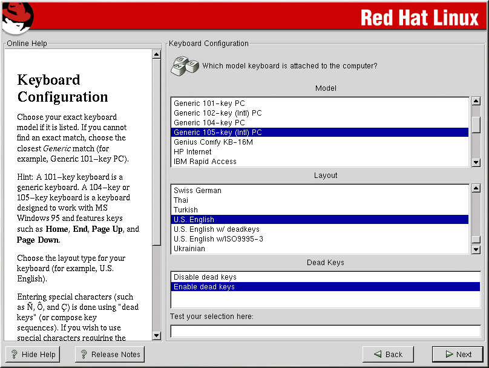
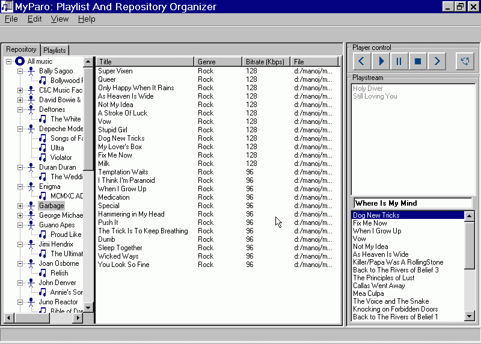
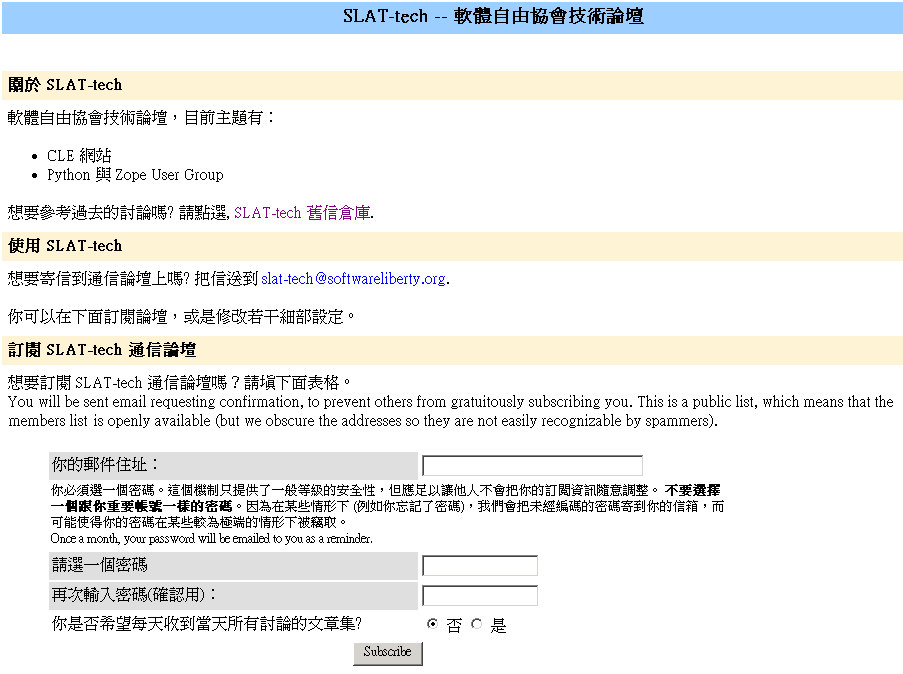
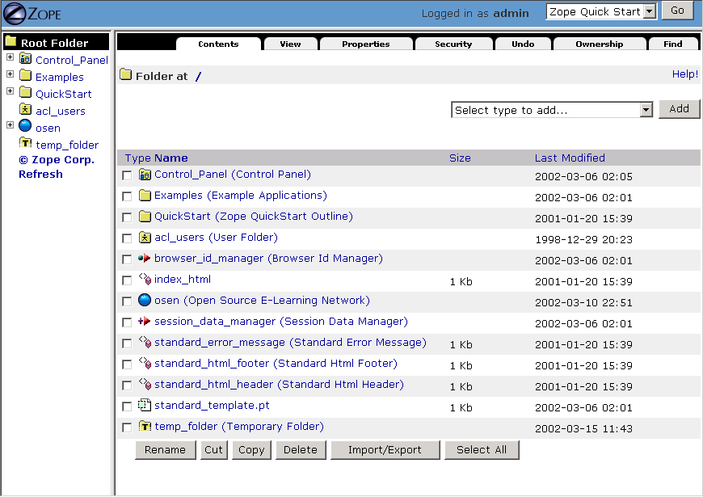
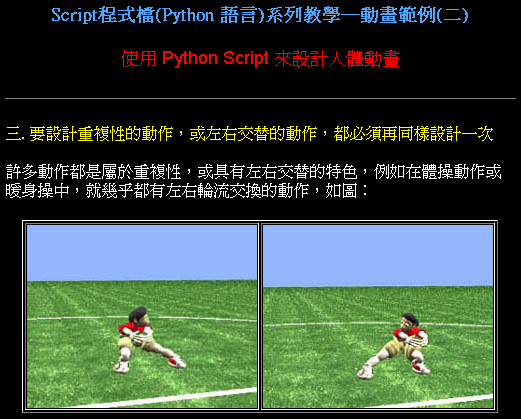

.. 
  練功坊

  巨蟒必殺術起手式 (上)

  文．馬兒 <marr@slat.org>

  ●中標●
  來龍去脈

  剛結束一年份的 Python 之旅，一路從 Python 入門初探，走到 Zope 及 CMF 應用，回顧起來，似乎還是顯得腳步匆匆，蹤徑浮亂，心想，或許仍有不少朋友跟著在學習之路上亂闖，    導致浪費不少寶貴時間，著實深感不安。

  凡走過必留痕，如果朋友們不灰心及不嫌棄的話，近日內正準備一些相關的學習教材，讓以往曾經累積過的素材，有機會進一步粹鍊成更精緻、更具吸引力的學習資源。

  ●中標●
  楔子

  在自由軟體的世界裡，有許多世外桃源是被巨蟒 (Python) 所守衛著，由於外人對巨蟒不熟悉，害怕接近，或是不知如何親近，連帶也無法窺見巨蟒所盤據世界，裡頭竟是多麼令人嚮往。

  這裡準備了一份「巨蟒必殺術」秘笈，內容其實就是指示你如何開始逐步了解 Python 的習性，慢慢養成終日與之相處的方法，你將會發現，朝夕相處的結果，巨蟒將成為你的守護神，直接幫助你解決許多生活上的問題。此外，Python 世界裡所累積的寶藏，也將讓你享用不盡，大呼過癮。

  ●中標●
  師父領進門

  在設計上，這份巨蟒必殺術就是一份快速教學手冊，預設學員對象為「對於自由軟體之程式語言，具備學習興趣的中學生以及大專生」。所以，很歡迎各級老師先行參考秘笈內容，不吝批評指正，以便讓所有引用的朋友，能夠更容易上手。

  由於現有內容屬於「通用」性質，日後會結合「Python by Example」或「Python by Project」的「應用」性質，以產生更大的使用價值。想要利用 Python 進行專案開發的朋友，煩請先稍安勿躁。

Python 的學習曲線和緩，獲得入門的基本物件後，即可解決許多日常生活的應用問題，與其他語言相較，顯得極具競爭力。想要無師自通，不但沒有困難，而且 Python 很可能是學習成本最低的一種。如果你之前從未學習過任何程式語言，Python 正是優秀的入門之選。

..
  ●中標●
  進可攻、退可守

選擇 Python 做為入門的程式語言，我能相信你日後一定不會後悔，但如果你希望只學 Python 就能滿足所有期望，恐怕是不容易如願。

由於 Python 並非系統語言 (System Language)，在執行效能上，未能如 C 語言一般快速，因此在著重執行效率的應用場合裡，你應該利用 Python 與 C 語言巧妙結合的「延伸」(extension) 功能 [1]，以便突破執行效能的瓶頸。

很多朋友會躊躇懷疑，到底該使用 Python 或是 Java 工具。簡單的答案，可以是「請學 Python 語言，但不妨直接使用 Java 的工具」。Java 世界的物件工具相當豐富，透過類似 JPython (Jython 是其中一個專案 [2]) 的成果，Python 程式人員是可以和 Java 資源結合相通的。

.. 圖一：利用 jython 所製作的 applet 示範

再次強調，Python 無意也不可能取代所有程式語言的功能，善用不同語言間的特性優勢，實際解決你的問題，這才是學習及應用 Python 語言的重要哲學。世上絕無一套程式語言能夠滿足每個人的所有需求，但 Python 能夠滿足你最常見的基本需求，它就像是一把瑞士刀，小巧精緻，隨身相伴，無往不利。

..
  ●中標●
  藏經閣

  這份文件將被置於 Python/Zope User Group 網站的教學資源內 [3]，日後若有相關的更新資料，你可以在此尋得，其他諸如投影簡報檔、講義、習題等，也一併累積於此。

  如果你恰巧是校園的老師或學生，對於這份文件有應用的需要，歡迎免費使用，但煩請寄信告知使用的狀況，以便成為日後有人打算進行 Python 應用實況調查的參考。

  秘笈內容分有「套式」，在此稱為「模組」(Module)，原則上，學完一套至少費時二小時，所以講師在教導時，可以依此原則斟酌份量，準備二至三小時的課程，讓學員確實循序漸進地完成一個套式的內容。

  教學進行時，講師可以配合一份投影簡報檔 (目前為英文簡報內容，如圖二所示)。一個模組的內容中，每隔三十分鐘左右，簡報內容會顯示簡單結論整理，提供檢查表，讓學員回顧自己已經學過的內容重點。

  圖二：教學手冊投影簡報

  ●中標●
  模組一學習目標

在第一個模組內容中，學員將認識下列的學習目標：

  * Python 基本資訊

    包括簡單發展歷史，語言特性，應用場合，安裝方式。

  * 基本物件型別

    包括數值 (Number)，字串 (String)，串列 (List)，值組 (Tuple)。

  * 基本內建函式

    包括 print，len()，rang()，type()，id() 等。

  * 流程控制

    包括迴圈語法 (Loop)，區塊式語法結構特性。

..
  ●中標●
  Python 基本資訊

  Python 目前的最新版本是 2.2.x，可以由 http://www.python.org/ 網站免費下載程式安裝。基於跨平台的優秀特性，使用者可以在 Linux、FreeBSD、Windows、MacOS、DOS、Solaris 等作業環境上發現 Python。

  Linux 及 FreeBSD 的使用者，在安裝系統時，通常就可以選擇安裝此一程式套件，相當簡易。圖形函式庫的搭配，在安裝上是另一項議題，幸好在本教學手冊內的安排裡，前兩、三個模組並不會需要使用到圖形函式庫。

  平常使用 Windows 環境的新手，在入門之際，建議可以優先選用 ActiveState 公司 [4] 所發展的 ActivePython 程式來安裝，這個工具程式本身不但與 Python 原版程式相容，更具備「詳細線上補助說明」、「互動性高的圖形操作環境」、「更易用的編輯器」等優點 (如圖三所示)。

  在 http://zope.slat.org/Tutor/ 網址裡，已整理 ActivePython 程式檔案供學員下載，檔案大小約 12 MB，內附 Python Interpreter Shell、PythonWin Environment、Python Package Manager 三個工具程式，以及 ActivePython Documentation 與 Dive Into Python 兩份說明文件。
  此時 Python 已全面進入 2.x 版本世代，舊版的 1.5.x 或 1.6.x，大部份的功能仍適用於新版中，但在教學手冊裡，將會以 2.x 版本的功能為主。

  圖三：ActivePython 操作環境示範

  ●中標●
  另一優秀工具 cygwin

  透過 cygwin [5] 這套小巧卻基本功能完整的工具程式， Windows 使用者可以非常輕鬆地獲得一個模仿 Linux 操作習慣的基本環境。這是一套在 Windows 系統上提供 Unix 環境的程式集合，由 Red Hat 公司 (事實上是 Cygnus 公司，已被 Red Hat 公司購併) 所開發。整套工具包含兩個部份：

  * 一個 DLL (cygwin1.dll) 檔案，擔任 UNIX 模擬層的角色，提供基本 UNIX API 功能。
  * 一組移植自 UNIX 的工具程式，提供延續自 UNIX/Linux 使用習慣的功能。

  cygwin 包含多項工具程式，當然也有 Python 語言程式，其他著名者，例如 vim、apache、wget、lynx、mutt 等 (如圖四、圖五所示)。

  圖四：在 cygwin 環境下使用 lynx 程式

  圖五：在 cygwin 環境下使用 Python 交談環境

  初學者通常不易離開 Windows 操作環境，為了入門 Python 而安裝完整的 Linux，顯得過於大費周章，因此 cygwin 成為極有利的切入點。安裝 cygwin 後，可以獲得一個具體而微的 Linux 操作環境，例如使用 vim 編寫 Python script 檔案，整個習慣與實際的 Linux 環境相仿，不喜歡 vim 編輯環境的朋友，可以藉助於 ActivePython 的編輯工具。

  ●中標●
  Python 的應用軟體

為了增加學員的學習企圖心，先簡列一些 Python 的軟體成果，讓大家知道「原來 Python 已經可以做這些事」。

* Anaconda -- Red Hat Linux 的開機安裝程式，即是以 Python 語言撰寫成，稱為 Anaconda，這名稱同樣是一種大蟒蛇。

* MyParo -- 這是一個 MP3 檔案庫的整理程式，具備一個類似檔案總管的介面，使用者可以快速查詢及播放 MP3 資料。

* mailman -- 現在有越來越多的郵遞論壇系統，採用 mailman 這套程式，它包含一組網頁介面，讓使用者相當容易擁有一個討論空間。

* Zope -- 以 Python 為發展基礎的應用程式伺服器，內容包括網頁伺服器、動態網頁語言、資料庫連結介面、物件資料庫等。想要見識它的實作結果，歡迎造訪 Python/Zope User Group 網址 [3]。

* Animation -- 已有專業動畫的從業朋友，以 TrueSpace 搭配 Python script 製作動畫編輯工作。

●中標●
直譯器的頭號功能

假設你的 Windows 系統裡已經裝上 ActivePython，啟動 PythonWin Environment 程式後，會看到「>>> 」符號，這就是 Python 直譯器的命令提示符號。請依序輸入下列的內容，用以計算一個含稅貨品的價格：

  >>> tax = 6.5/100
  >>> price = 250
  >>> tax * price
  16.25
  >>> price + _
  266.25

除了直接將 Python 直譯器當作計算機之外，還可以直接利用 print 指令來顯示簡單訊息：

  >>> print "hello world"

這在 C 語言當中，很可能是類似下列的程式碼：

  main()
  {
      printf("hello world\n");
  }

顯然地，Python 很輕鬆就完成了這件事，而且事情也該如此簡單。C 語言的程式，除了必須存在原始碼的內容外，還需要經過編譯、連結的過程，以「顯示 hello world 訊息」而言，簡直是殺雞動牛刀了。

使用 ActivePython 的 PythonWin 直譯器，有項極為便利的優點，當你不小心輸入錯誤資料並按下確認鍵時，可以按下 Ctrl + Z 鍵，取消之前的錯誤動作。記得熟悉並善用這項功能。

●中標●
Python 基本物件型別

在 Python 世界裡，程式的每一個項目都被視為物件 (object)，初學之際，我們將先認識最基本、最簡單的物件型別，它們分別是：

* 數值 (Number)
* 字串 (String)
* 串列 (List)
* 值組 (Tuple)
* 辭典集 (Dictionary)

物件本身會包含著一些資料 (data) 或屬性 (attribute)，我們可以利用函式 (function) 或物件方法 (method)，來對物件進行操作處理，另外再利用邏輯判斷、迴圈等流程控制技巧，產生我們所需要的結果。

在教學手冊的模組一當中，將至少了解前四種基本物件型別，而辭典集將在模組二中解說，基本的邏輯判斷與迴圈功能，會在解說串列之際，引入介紹，並且搭配相關的程式習題。串列的熟悉與應用，可說是模組一裡最具份量的主題。

●中標●
數值型別

基本的數值，又可細分有下列四類 (可參考表一)：

* 整數 (Integer)：例如 7 * 5 + 2 - 18 這樣的四則運算裡，參與計算的物件都是整數。

* 長整數 (Long Integer)：其表示法是在整數資料的尾端，加上一個「L」符號，例如 1000L。亦可使用小寫的「l」符號，但容易與「1」符號相混，故建議使用「L」符號即可。

* 浮點數 (Float Point Number)：例如 3.1415926 這樣的數值，即是浮點數。

* 虛數 (Imaginary Number)：一個複數 (Complex Number) 可視為一個整數加上一個虛數，例如 (3 + 5j)。

+------------------------------------+-------------------------+
| 數值資料型別                       | 範例                    |
+====================================+=========================+
| 1. 整數 (Plain Integers)           | 7, -7, 256              |
+------------------------------------+-------------------------+
| 2. 長整數 (Long Integers)          | 7L, 10L, -777777777777L |
+------------------------------------+-------------------------+
| 3. 浮點數 (Floating Point Numbers) | 7.0, 2e8, -7e10         |
+------------------------------------+-------------------------+
| 4. 虛數 (Imaginary Numbers)        | 3+2j, -4-2j, 4.2+6.3j   |
+------------------------------------+-------------------------+
.. 表一：數值資料型別的基本四類

Python 裡的整數型別，是以 C 語言的 long 型別來實作，也就是 32 bits 的精準度。在x86 PC 上，一般整數型別的最大極限為 231 - 1，即 214783647。在舊版的 Python 裡，當運算結果超過整數型別時，會產生 OverflowError 的錯誤訊息，在新版的 Python 裡，則會自動將數值改以長整數表示。

●中標●
基本之數值運算

先試試下列的例子：

  >>> 2 ** 30

一個「*」符號，表示「相乘」之意，兩個「**」符號，表示「次方」之意，也就是「指數運算」。因此上例表示要進行「2 的 30 次方」運算，答案會是 1073741824。

再試試「2 的 31 次方」運算：

  >>> 2 ** 31

答案會是 2147483648L，由於「L」符號的出現，可知「2 的 31 次方」運算結果已大於整數型別的最大邊界。

下列的例子則將解說一個重要的數值運算原則：

  >>> 5 / 2
  2
  >>> 5.0 / 2
  2.5

整數間的四則運算，其結果還是一個整數，如果是長整數或浮點數之間的運算，其結果則同樣是長整數或浮點數。

Python 允許簡便地使用科學記號進行運算，例如：

  >>> 3.5e3 * 2.0e4
  70000000.0

指數運算的方式，除了上述的「**」符號外，還可以利用 pow() 這個內建函式：

  >>> pow(2, 30)

這個例子同樣是「2 的 30 次方」運算。pow() 內建函式必須接受兩個參數，一個為底數，一個為指數，如果參數個數不正確，則會產生錯誤訊息：

  >>> pow(2)
  Traceback (most recent call last):
    File "<stdin>", line 1, in ?
  TypeError: pow() takes at least 2 arguments (1 given)

●中標●
其他的數值運算

下列是一些延伸的數值運算練習，試著輸入運算內容，查看結果為何：

  >>> max(10, 13, 7)
  >>> min(10, 13, 7)

max() 與 min() 分別是取得最大值與最小值的內建函式。

  >>> divmod(7, 3)

divmod() 需要輸入兩個參數，一個為被除數，一個為除數，其運算結果是傳回商數及餘數。

  >>> hex(11)
  >>> oct(8)

hex() 與 oct() 則是用來傳回十六進位與八進位的結果。

  >>> import math
  >>> math.pow(2, 3)
  >>> math.sqrt(2)
  >>> math.pi

另外，Python 裡提供一個 math 模組服務，透過「import math」呼叫的手續，可以使用 math.pow()、math.sqrt() 兩個物件方法來進行指數與開根運算，同時也可以引用 math.pi 這個數值變數。

●中標●
字串型別

在 Python 當中，只要將幾個文字包含在單引號、雙引號、三引號裡，就可以建立一個字串，下列即是三種建立方式的範例：

  >>> a = 'I Love Python'
  >>> b = "It's nice to learn Python"
  >>> c = """
  ... this is a triple quote demo.
  ... see? we can go even cross lines :)
  ... remember to end it with another triple quote.
  ... """

上述的「...」符號，用以表示整個語法敘述內容仍未全部結束，通常當一個語法敘述的末尾出現時，也代表語法敘述仍未結束，必須在下一行中持續輸入，如下例：

  >>> b = "It's nice \
  ... to learn Python"

●中標●
基本之字串運算

完成字串的建立後，可以使用「索引運算」(indexing) 來取得字串裡的元素 (element) 內容，例如：

  >>> a[0]
  'I'

字串進行索引運算的方式，就是在字串變數後接著 [n] 這樣的符號，其中的 n 代表著元素編號，由 0 開始進行編號，所以 a[0] 代表字串 a 的第一個元素內容。

  >>> a[-1]
  'n'

若在元素編號裡使用負整數，則表示索引運算以「反向」方式進行，稱之為「反向索引」(nagative indexing)，此時必須以倒數方式尋找元素位置，所以 a[-1] 代表字串 a 的倒數第一個元素內容。

再進階的運算就是「分割運算」(slicing)，它可以取得元素組的內容，例如：

  >>> a[2:6]
  'Love'
  >>> a[:-4]
  'I Love Py'

字串進行分割運算的方式，就是在字串變數後接著 [m:n] 這樣的符號格式，其中的 m 代表著起點，n 代表著終點，不但如此，同時也支援正向索引與反向索引的運算方式。

  >>> c[-22:]
  'another triple quote.\n'

注意到 c[-22:] 結果裡最後出現的「\n」符號，它代表換行符號之意。

某種角度來看，字串像是「以字元為元素的串列」，因此，有關字串的索引及分割運算，將在進行串列介紹之際，以圖解方式更加詳細地說明，屆時應可進一步獲得觀念澄清。

●中標●
其他的字串運算

下列是一些延伸的字串運算練習，試著輸入運算內容，查看結果為何：

  >>> len('string')
  >>> len(a)

內建函式 len() 可以計算物件元素的個數，以字串為例，元素個數指的就是字元個數。

  >>> slogan = 'I Love Python'
  >>> ver = 2.2
  >>> slogan + ver
  >>> slogan + ' ' + str(ver)

由於字串與數值兩種物件無法直接進行「連結」運算，通常就是利用 str() 內建函式，先將數值轉為字串型別後，再進行連結運算。

  >>> slogan.count('o')

字串物件附有一個 count() 的物件方法 (method)，其使用方式就是字串變數後，接著一個「.」符號，再接 count() 物件方法，並傳入元素或元素組作為參數。以 slogan.count('o') 為例，它會找尋 slogan 字串裡「o」字元出現幾次，傳回加總的結果為 2。

  >>> print "slogan has %s characters." % len(slogan)
  >>> print "slogan has %s o's." % slogan.count('o')

這是個 print 指令的應用技巧，將打算顯示的變數值以「%s」符號代表，而在字串之後，再接一個「%」符號，以及實際回傳變數值的敘述。

●中標●
物件之基本操作

雖然，至此我們剛學到兩個物件型別而已，但已經足以製造出多姿多彩的物件世界，以下便是一些管理物件資訊的相關基本操作：

  >>> type(slogan)
  <type 'string'>
  >>> type(ver)
  <type 'float'>

內建函式 type() 可用來顯示物件的型別資訊，通常是輸入想要查詢的物件名稱，例如 type(slogan) 傳回資訊表示 slogan 是一個字串型別。日後，學員認識更多其他物件型別時，同樣可以使用 type() 來進行查詢。

  >>> dir()
  ['__builtins__', '__doc__', '__name__', 'a', 'b', 'c', 'slogan', 'ver']

內建函式 dir() 可用來顯示現有環境下的物件名稱空間 (name space) 狀況。當初次啟動 Python 直譯器時，Python 的物件世界最為純淨，你應該只會看到 ['__builtins__', '__doc__', '__name__']這樣的資訊，而諸如 'a', 'b', 'c', 'slogan', 'ver' 都是隨著操作練習的過程，所新建增加的物件名稱，一旦物件被新建產生出來，你可以透過 dir() 來進行資訊查詢。

  >>> del(slogan)

指令 del() 可以將一個物件自名稱空間裡刪除，例如 del(slogan) 會把 slogan 物件刪除，事後再以 dir() 查詢時，便會發現 slogan 已經不復存在。

  >>> dir(a)

dir(a) 用以查詢物件 a (也就是一個字串) 的名稱空間狀況，例如 'count' 就是先前已經簡介過的字串物件方法之一。

  >>> dir(__builtins__)

這個指令會產生一長串的資訊內容，這正是「內建物件及函式」之列表，你可以發現部份的列表項目是已經學習過的，例如 pow, max, min, hex, oct, divmod, len, str, type, dir 等。學員在後續的學習內容中，會繼續認識更多的內建物件及函式。

●章節小結●

在這約三十分鐘的教學內容裡，學員應該已經具備下列觀念：

 * Python 的基礎資訊：包括其語言特性、應用場合等。
 * 可以進行基本的操作：包括了解如何啟動 Python 直譯器，針對數值及字串進行運算。
 * 認識最常見的內建函式：包括 len()、print、dir() 等。

接下來的教學手冊裡，將進行串列與值組的介紹，並且引入流程控制的使用。

●中標●
相關資源

[1] 由 Guido van Rossum 所撰寫的 Extending and Embedding the Python Interpreter 文件中，說明了如何將 Python 與 C 語言進行結合，請至 http://www.python.org/ 取得線上文件。
[2] Jython 是一套以 Java 程式語言為基底的 Python 實作品，為了與傳統 C 語言的實作品相區別，通常分別以 CPython 與 JPython 稱之。詳細說明可造訪 http://jython.sourceforge.net/ 網址。
[3] Python/Zope User Group 為台灣 Python 與 Zope 愛好者的交流園地，請造訪 http://zope.slat.org/ 網址取得更多資訊。
[4] ActiveState 公司以提供開放源碼程式語言工具聞名，請至 http://www.activestate.com/ 網址造訪。
[5] Red Hat 公司之 cygwin 工具產品，可至 http://cygwin.com/ 網址取得資訊。

