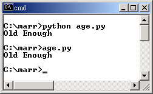

..
  練功坊

  巨蟒必殺術起手式 (下)

  文．馬兒 <marr@slat.org>

在學習教材的第一個模組內容中，學員將認識下列的學習目標：「Python基本資訊」、「基本物件型別」、「基本內建函式」、「流程控制」，截至前期內容為止，已介紹到最常見的物件型別及內建函式，本期內容將進行串列與值組的介紹，包括分割運算的詳細解說，並且引入流程控制的使用。

●中標●
串列型別

和C語言的陣列(array)型別相比，Python的串列(list)顯得非常具有彈性。一來，串列裡的元素項目，可以為任意種類的型別，並未被限制要型別一致，預設就是「動態陣列」的運作方式，所以使用者可以相當直覺地設定串列內容，二來，串列物件預設搭配「索引運算」、「分割運算」、「排序運算」等內建物件方法，使用者很快就能上手解決最常見的字串或檔案處理問題。

「數值」與「字串」型別，都是資料的基礎單位，而「串列」則是資料實際利用時，常見的處理單位之一，熟悉其相關使用細節，是重要的入門功課。請先依照範例，嘗試建立下列的串列物件：

  >>> x = ['come', 2, 7.0, "eleven"]
  >>> x[0]
  'come'

利用「[」與「]」符號，如上例，即可建立一個名稱為 x 的串列物件，其元素 (element) 共計四個，分別是 'come'、"eleven" 兩個字串，一個 2 的整數，以及一個 7.0 的浮點數。串列同樣具備索引運算來取得元素內容，例如 x[0] 是代表 'come'，而 x[1] 是代表 2。非但如此，元素項目本身也可以是一個串列，形成巢狀串列 (Nested List)，如下列：

  >>> y = ['a', 543, [1, 'another list']]
  >>> y[2]
  >>> len(y)

串列 y 本身共計三個元素，其第三個元素 (即 y[2]) 就是一個串列物件，這是一個巢狀串列的範例。甚至可以利用 y[2][1] 的方式，來取得巢狀串列裡的元素內容：

  >>> y[2][1]
  'another list'

●中標●
分割運算

在前期內容中，已經簡介了字串的分割運算 (slicing) 運作方式，此處將應用圖解方式來做細節說明。適用分割運算的物件項目，包括字串、串列、值組等，而它們又是「序列物件」(Sequence) 的三個例子。

序列物件進行分割運算的方式，就是在序列物件變數後接著 [m:n] 這樣的符號格式，其中的 m 代表著起點，n 代表著終點，不但如此，同時也支援正向索引 (positive indices) 與負向索引 (nagative indices) 的運算方式(如圖1所示)。

搭配圖示對照後，可以很輕易地看出 y[1:3] 和 y[1:-1]，指的都是 "second" 與 "third" 所組成的串列結果，也稱為串列 y 的一個「切片」(slice) 或「子序列」(Subsequence)。實際操作結果如下：

  >>> y = ['first','second','third','fourth']
  >>> y[1:3]
  ['second', 'third']
  >>> y[1:-1]
  ['second', 'third']

分割運算若省略「指明」的起點，則代表從最前面的元素取起，若省略「指明」的終點，則代表取至最後面的元素為止。

  >>> y[2:]
  ['third', 'fourth']
  >>> y[:-2]
  ['first', 'second']
  >>> y[:]
  ['first', 'second', 'third', 'fourth']

當起點落在終點之後時，分割運算的結果會是空串列，如下列範例：

  >>> y[-3:-2]
  ['second']
  >>> y[-2:-3]
  []

若「指明」的起點與終點都被省略，當然是回應從頭到尾的全部元素，但這樣的方式常是複製串列實體的技巧，如下列範例：

  >>> y[:]
  >>> x = y[:]

如上例的 x = y[:]，串列 y 的所有元素項目會傳回，讓物件 x 被指定成為串列 x，其元素項目和串列 y 的元素項目相同。

●中標●
串列與內建函式的應用

除了 len() 之外，還有一些常見的內建函式可搭配串列物件來使用，下列是一些運算練習，試著輸入運算內容，查看結果為何：

  >>> ['Free','Open'] + ['Linux','BSD']
  ['Free', 'Open', 'Linux', 'BSD']
  >>> ['Free','Open'] * 2
  ['Free', 'Open', 'Free', 'Open']

使用 + 運算符，可以為兩個串列進行「連結運算」，使用 * 運算符，可以為串列進行「元素重複」的運算。

  >>> max(y)
  >>> min(y)

max() 與 min() 搭配串列時，會先把所有元素依照「數值在前」、「字串在後」的方式，將兩種型別分堆後，再進行大小比對。英文字串的大小，是依 ASCII 的字元順序來決定(註1)。

  >>> 'third' in y
  1
  >>> 'fifth' in y
  0
  >>> 'fifth' not in y
  1

想要測試串列是否包含某個元素項目，可以使用 in 運算符，這樣的運算式稱為「成員測試」(Membership Test)。舉例來說，字串 'third' 是串列 y 的一個元素成員，所以測試結果傳回 1 (代表為「真」)，而字串 'fifth' 並不是串列 y 的一個元素成員，所以測試結果傳回 0 (代表為「假」)，也可以使用 not in 運算符，用以測試串列是否「不包含」某個元素項目。

●中標●
串列與物件方法的應用

串列本身也附有一些物件方法，而且，部份使用方式與字串的物件方法相仿：

  >>> y.count('first')
  1

串列的物件方法 count() 接受一個元素項目作為參數。以 y.count('first') 為例，它會找尋串列 y 裡「first」元素出現幾次，傳回結果為 1。

  >>> y.index('third')
  2

串列的物件方法 index() 接受一個元素項目作為參數。以 y.index('third') 為例，它會比對串列的元素內容項目，傳回第一個比對成功之元素項目的索引值，第一個 (本例中也是唯一的一個) 出現的「third」元素在串列 y 中的索引值是 2。

●中標●
更改串列元素內容

串列的元素內容不但可以被改變，而且方式很多種，下列將依序簡介部份方式：

  >>> x = [1,2,3,4,5]
  >>> x[1] = "two"
  >>> x
  [1, 'two', 3, 4, 5]

上述為「指定運算」的範例，將串列 x 的第二個元素內容指定為字串 "two"。

  >>> x.insert(2, 2.5)
  >>> x
  [1, 'two', 2.5, 3, 4, 5]

串列的物件方法 insert() 必須接受兩個參數值，第一個為「索引值」，所以它應該是個整數值，第二個參數值就是準備要插入的元素項目，它可以是任何物件型別。以 x.insert(2, 2.5) 為例，它會在索引值為 2 的元素「前面」，插入「2.5」這個新元素項目。

  >>> x.reverse()
  >>> x
  [5, 4, 3, 2.5, 'two', 1]

串列的物件方法 reverse() 並不需要接受參數，執行後會將整個串列的元素內容，順序倒置。

  >>> x = [0,1,2,2,4,8,32]
  >>> del x[0]
  >>> x
  [1, 2, 2, 4, 8, 32]
  >>> del x[3:4]
  >>> x
  [1, 2, 2, 8, 32]

內建函式 del 除了可以刪除名稱空間裡的物件變數，也可以用來刪除串列的部份元素內容，搭配索引運算或是分割運算，均可以處理。值得注意的是，有另外一個容易和 del 混淆的，是串列物件方法 remove()。

  >>> x.remove(2)
  >>> x
  [1, 2, 8, 32]
  >>> x.remove(16)
  Traceback (most recent call last):
    File "<stdin>", line 1, in ?
  ValueError: list.remove(x): x not in list

串列的物件方法 remove() 必須接受一個參數，以 x.remove(2) 為例，它會比對串列的元素內容項目，若找到第一個值為 2 的元素項目，便會將其刪除 (本例中，包含兩個值為 2 的元素項目)。若找不到符合的元素項目，則會傳回「list.remove(x): x not in list」的 ValueError 錯誤訊息。

  >>> slat = ['Free','Open']
  >>> slat.append(['Linux','BSD'])
  >>> slat
  ['Free', 'Open', ['Linux', 'BSD']]

串列的物件方法 append() 必須接受一個參數，此參數可以是任意的物件型別。以 slat.append(['Linux','BSD']) 為例，輸入的參數是一個串列物件 ['Linux','BSD']，執行後，參數會整個被併到原串列之後，成為串列 slat 的最後一個元素項目。值得注意的是，有另外一個容易和 append() 混淆的，是串列物件方法 extend()。

  >>> slat = ['Free','Open']
  >>> slat.extend(['Linux','BSD'])
  >>> slat
  ['Free', 'Open', 'Linux', 'BSD']

串列的物件方法 extend() 必須接受一個參數，而且此參數必須是串列或值組。以 slat.extend(['Linux','BSD']) 為例，輸入的參數是一個串列物件 ['Linux','BSD']，執行後，參數的每一個元素項目，會逐一各別被併到原串列之後，成為串列 slat 後面的一群元素項目。值得注意的是，當參數是單一元素項目 (single element) 的串列或值組時，append() 與 extend() 的執行效果是相同的。

●中標●
串列的排序運算

串列也支援排序 (Sorting) 的物件方法，這是很常見的技巧之一。

  >>> y = ['first','second','third','fourth']
  >>> y.sort()
  >>> y
  ['first','fourth','second','third']

串列的物件方法 sort()，最簡單之使用方式，可以不必輸入參數，執行後，會將元素項目先進行分類，例如數值型別在前、字串型別在後的原則，而字串物件又會依照字元順序，處理後傳回。值得注意的是，排序的動作是「原物當場發生」(in-place sort) 的，以 y.sort() 為例，執行後，串列 y 的元素項目順序已實際變動，和執行前已有不同。如果想要讓排序動作未影響原串列的元素項目順序，必須另外事先複製串列元素內容。

  >>> x = y[:]
  >>> x.sort()
  >>> x
  ['first', 'fourth', 'second', 'third']
  >>> y
  ['first', 'second', 'third', 'fourth']

如上例，事先利用 x = y[:] 將串列 y 的所有元素內容複製到串列 x，然後再對串列 x 進行排序運算，如此一來便不會影響原有串列 y 的元素內容。

最後，值得說明的是，串列的物件方法 sort() 也可以輸入參數，此參數的型別是個函式 (function)。輸入參數給 sort() 的目的，是為了產生客製化的排序效果，亦即，排序的原則與方式，由使用者自行決定，而非由系統預設值所提供。相關細節將留待介紹函式時再做說明。

●中標●
內建函式 range

至此，學員已熟悉「數值」、「字串」、「串列」的基本操作，只要再學習幾個基本的迴圈語法，就可以擁有一片足夠廣闊的Python世界。首先，由內建函式 range() 出發：

  >>> range(10)
  [0, 1, 2, 3, 4, 5, 6, 7, 8, 9]

內建函式 range() 必須接受一至三個參數，這些參數都是整數型別。最簡單的方式，就是輸入一個整數，如上例的 range(10)，代表要產生「一個由整數所組成的串列」，預設的元素起始值由 0 開始，而輸入的 10 代表的是元素結束值。完整的 range() 函式參數格式為 range([start,] stop[, step])，所以 range(10) 的執行效果等同於 range(0, 10)，或是 range(0, 10, 1)，因為預設的數值增加量為 1。在本例中，串列元素的最後一個數值會是 10 - 1，亦即 9。

  >>> range(1, 10)
  [1, 2, 3, 4, 5, 6, 7, 8, 9]

當 range() 輸入兩個參數時，第一個參數代表元素起始值，第二個參數代表元素結束值。例如 range(1, 10) 會傳回九個整數所組成的串列，第一個元素值為 1，最後一個元素值為 10 - 1，亦即 9。

  >>> range(0, 10, 3)
  [0, 3, 6, 9]

如果要調整參數裡的數值增加量 (step)，請同時輸入三個參數值，以 range(0, 10, 3) 為例，代表元素起始值為 0，元素結束值為 10，而數值增加量為 3。

內建函式 range() 經常與 for 迴圈語法結合搭配，用以重覆操作某個序列物件內容。

●中標●
流程控制

Python 語言裡的流程控制 (Control Flow) 主要分成三類：

* 條件 (Conditional)
   常見為「if - else」與「if - elif - else」兩種型式。

* 迴圈 (Loop)
   分為「while」與「for」兩種型式。

* 例外 (Exception)
   常見為「try - except」型式，另有「raise」型式亦屬之。

上述三類，又以前兩者比較基本，「例外」的操作屬於進階功能。在實際操作流程控制的程式前，學員必須先熟悉 Python 語言裡的「程式行結構」、「程式區塊結構」、「命令稿執行方式」等內容。

●中標●
程式行結構

Python 的程式內容是由敘述式 (statement) 所組成，而敘述式必須存在於「邏輯行」(logical line) 內。例如下列的敘述式內容：

  >>> slat = ['Free','Open'] + ['Linux','BSD']

上述是一個完整的 Python 敘述式，當使用者打完內容後，緊接著按下 'Enter' 鍵時，便表示完成一個「實體行」(physical line) 的輸入。通常，「實體行」的邊界就是「邏輯行」的邊界，但是使用者可以利用反斜線符號「\」，來將數個「實體行」併起來成為一個「邏輯行」，例如下列的敘述式內容：

  >>> slat = ['Free','Open'] + \
  ... ['Linux','BSD']

當使用者打完敘述式的部份內容，緊接著輸入一個「\」符號後，雖然表示完成一個「實體行」的輸入，但並未表示已完成一個「邏輯行」的輸入。此時，Python 直譯器會回應一個「... 」提示符號，表示在這個實體行裡的輸入內容，會與前面的實體行合併為一個邏輯行內容(註2)。

簡單地說，使用者可以利用「\」符號來為敘述式內容進行分行，通常這是為了「提高程式碼易讀性」而做的處理。

另外，值得說明的是，Python 使用「#」符號作為程式碼註釋內容的起始標記。這點和 C 語言及多數 Unix 操作傳統相符。

●中標●
程式區塊結構

Python語言使用「縮排方式」(identation)和「:」符號，來規定及協助程式邏輯的組織，使用者在閱讀程式碼時，可以對邏輯區塊產生一目瞭然的效果。下列是一個簡單的例子：

  >>> age = 25
  >>> if age > 20:
  ...     print "Old Enough"
  ... else:
  ...     print "Too Young"
  ... 

特別注意到，上例的 print 指令前，都必須使用「空白符號」(例如「空白鍵」或「Tab 鍵」) 來進行縮排動作。以空白鍵為例，輸入幾個空白鍵都可以，但是同一個邏輯區塊的程式內容，必須彼此標齊(註3)。下列是一個示範，同時包括正確及錯誤的區塊內容(註4)：

  age = 25
  if age > 30:
      print "Sorry"           # 正確語法
      print "Too Old"         # 同一邏輯區塊
  elif age > 20 and age < 30:
        print "Fine"          # 正確語法
        print "Old Enough"    # 同一邏輯區塊
  else:
      print "No"              # 錯誤語法
        print "Too Young"     # 同一邏輯區塊的內容必須標齊

通常，使用者可以考慮利用「Tab 鍵」來協助快速進行縮排動作，特別是將文字編輯器的縮排定位點，設定成移動四個字元的寬度(如圖2所示)。

.. image:: ../img/2002_0202.png
    :alt: 圖2 設定Windows環境裡的edit程式

●中標●
命令稿執行方式

除了直接和 Python 直譯器互動外，使用者也可以搭配文字編輯器，撰寫命令稿 (script) 來執行 Python 程式。PythonWin 環境裡的編輯器，預設搭配的是 NotePad 程式 (如圖3所示)，使用者可以把程式碼內容寫在檔案裡，撰寫完成後存檔即可 (例如檔名為 age.py)，慣例是使用 .py 的延伸檔名。

.. image:: ../img/2002_0203.png
    :alt: 圖3 PythonWin環境所附之編輯器

在 Windows 環境下，最單純的命令稿執行方式，是開啟一個 DOS 視窗，輸入類似「python age.py」這樣的指令，或是，直接輸入類似「age.py」這樣的指令(如圖4所示)。順利的話，都可以傳回及顯示執行結果。

若是使用 cygwin 操作環境的話，可以利用 vi 編輯器，進行程式原始碼的編寫，注意可以在程式碼的第一行加上「#!/usr/bin/env python」這樣的敘述，完成後存檔即可。cygwin 環境下的命令稿執行方式，也是直接在命令列，輸入類似「python age.py」這樣的指令，或是，直接輸入類似「./age.py」這樣的指令，此時必須搭配命令稿內容的第一行為「#!/usr/bin/env python」宣告(如圖5所示)。

在 Windows 環境裡，通常預設會依據延伸檔名的型式，主動連結相對應的執行程式，所以輸入「age.py」後即可逕自執行程式。相關的對應設定方式，在選取 age.py 檔案後，按右鍵，選擇「內容」即可查閱(如圖6及圖7所示)。

●中標●
while 迴圈

while 是 Python 的迴圈語法之一，其語法格式必須接受一個「表示式」(expression)，再接一個「:」符號。請以命令稿方式測試下列的程式碼，其檔名設定為 fact.py：

  n = 1
  r = 1
  while n < 10:
      r = r * n
      n = n + 1
  print r

這是一個階乘函數範例，相當於 1 * 2 * 3 ... * 9 的計算式，其執行結果為 362880(如圖 8所示)。上述程式碼裡的 n < 10，即是「表示式」，當 n 比 10 小的時候為「真」，程式流程會進入 while 迴圈裡，執行區塊內的程式內容，由於 n 的實際數值會逐次增加，直到 n 大於 10 的時候，便不再進入 while 迴圈裡，而執行最後一行的程式內容，列印階乘結果。

接著，下列是一個「無窮迴圈」的範例，其檔名設定為 endless.py：

  while 1:
      print "Print 'Ctrl + C' to Stop."

其執行結果將不斷出現訊息內容(類似圖9所示)。特別注意到，使用者必須利用 Ctrl + C 鍵來強制中斷程式的執行。由於表示式「1」代表「永遠為真」，所以程式流程將一直在 while 迴圈裡進行。

●中標●
由螢幕與鍵盤取得資料輸入

下列的程式範例使用了 raw_input() 內建函式，它可以從螢幕與鍵盤來讀取資料輸入，搭配迴圈語法後，適於用來建立簡單的互動式程式。請利用編輯器撰寫下列程式碼內容，並將檔名設定為 whatsee.py：

  while 1:
      age = raw_input('Your Age? ')
      if int(age) < 12:
          print "You can see Disney Movie."
      elif int(age) < 18:
          print "You can see Movie with parents."
      else:
          print "You can see any Movie."

上述的程式內容相當簡陋，但已經可以簡單運作，使用者可與執行結果進行互動(類似圖10所示)。

同樣地，本程式利用「while 1:」來產生簡單的無窮迴圈，原則上，可以利用「Ctrl + C」或「Ctrl + D」來讓迴圈中斷。內建函式 raw_input() 可接受一個字串型別的參數，其內容會顯示在螢幕上，成為提示詞。簡單地說，使用者必須回應一個「整數值」，它會被儲存於變數 age 內，不過 raw_input() 會將回應的資料內容以「字串」型別來儲存，所以在表示式裡，必須再次以內建函式 int() 進行轉換。

●中標●
for 迴圈

for 是 Python 的另一個迴圈語法，它常搭配的是序列物件，例如字串、串列、值組等，以便處理序列物件裡的元素內容，下列即是一個簡單的例子：

  todo = ['clean up', 'feed dog', 'sleep']
  for item in todo:
      print "I got to " + item

在上例中，串列 ['clean up', 'feed dog', 'sleep'] 的元素項目，會逐一被讀取，成為迴圈流程裡變數 item 的內容，直到串列的元素項目都處理完，才會結束整個迴圈。因此，上述範例的顯示結果，共計三行內容。

  beatle = ['john','paul','george','ringo']
  instr = ['guitar','bass','guitar','drum']
  for idx in range(len(beatle)):
      print "%s plays %s." % (beatle[idx], instr[idx])

for 迴圈經常與內建函式 range() 搭配，通常就是利用 range() 來產生串列的索引值。透過 len(beatle) 可以取得串列的元素個數，以便將元素項目逐一讀取完畢。

●中標●
進階串列操作

在前述的內容裡，學員已看過基本的指定運算，下列則是搭配分割運算後，顯得較複雜的指定運算：

  >>> a = [1,2,3,4,5]
  >>> a[2:5] = [4,8,16]
  >>> a
  [1, 2, 4, 8, 16]
  >>> a[1:] = [0]
  >>> a
  [1, 0]

上述的運算方式稱為「分割指定」(Slice Assignment)。例如 a[2:5] = [4,8,16] 代表將 a[2]、a[3]、a[4] 分別指定為 4、8、16。而 a[1:] = [0] 代表將串列 a 當中 a[1] 之後的元素，改以一個 [0] 來指定。

搭配上例，如果想要得到類似 [1,0,0,0,0] 的重覆指定效果，可以使用下列的範例：

  >>> a = [1,2,3,4,5]
  >>> for i in range(1,5):
  ...     a[i] = 0
  ...
  >>> a
  [1, 0, 0, 0, 0]

下列範例則具有「新增串列元素項目」的效果，可用以取代 extend() 的功能：

  >>> slat = ['Free','Open']
  >>> slat[len(slat):] = ['Linux','BSD']
  >>> slat
  ['Free', 'Open', 'Linux', 'BSD']

下列範例則具有「插入串列元素項目」的效果，和 insert() 部份類似：

  >>> slat = ['Free','Open']
  >>> slat[:0] = ['GNU']
  >>> slat
  >>> ['GNU', 'Free', 'Open']
  >>> slat[1:1] = ['GNOME','KDE']
  >>> slat
  ['GNU', 'GNOME', 'KDE', 'Free', 'Open']

下列範例則具有「刪除串列元素項目」的效果，和 del 類似：

  >>> slat[0:1] = []

●中標●
值組型別

Python 的值組 (tuple)，其使用方式與串列有諸多相似之處。請先依照範例，嘗試建立下列的值組物件：

  >>> t = ('come', 2, 7.0, "eleven")

利用「(」與「)」符號，如上例，即可建立一個名稱為 t 的值組物件，其元素 (element) 共計四個，分別是 'come'、"eleven" 兩個字串，一個 2 的整數，以及一個 7.0 的浮點數。不過，下列的指定範例中，未使用「(」與「)」符號，同樣是合法的值組指定方式：

  >>> t = 'come', 2, 7.0, "eleven"

值組一樣具備索引運算來取得元素內容，例如 t[0] 是代表 'come'，而 t[1] 是代表 2。值組的元素項目本身也可以是一個串列或值組，形成巢狀結構。

下列即是部份值組的操作範例，幾乎可以沿用先前串列的操作內容來進行對照：

  >>> t[2]
  >>> t[1:2]
  >>> len(t)
  >>> max(t)
  >>> min(t)
  >>> 2 in t
  >>> 2 * t

和串列相比，究竟值組有哪些不同之處呢? 首先，有個元素指定時的小細節要注意：

  >>> a = []
  >>> b = ()
  >>> type(a)
  <type 'list'>
  >>> type(b)
  <type 'tuple'>

上例中的變數 a 是一個「空串列」，而變數 b 是一個「空值組」，至此算是相當直覺，但請注意到指定「單一元素」時，兩者就有差別發生：

  >>> a = [3+4]
  >>> b = (3+4)
  >>> type(a)
  <type 'list'>
  >>> type(b)
  <type 'int'>

由於四則運算的執行，同樣使用了「(」與「)」符號，所以類似 (3+4) 這樣的表示式，是會被 Python 優先解釋成四則運算後的數值型別，而非值組型別。處理的辦法，該使用下列的指定方式：

  >>> b = (3+4,)
  >>> type(b)
  <type 'tuple'>

記得在數值型別之後，加上一個「,」符號，如此變數 b 就可以明確被解讀成一個「單一元素」的值組物件。下列則是另一個類似的狀況：

  >>> a = [3+4]
  >>> b = (a)
  >>> type(a)
  <type 'list'>
  >>> type(b)
  <type 'list'>

如果想要得到的效果，是建立一個「單一元素」的值組 b，而其元素正是變數 a，顯然上述的指定方式並不正確。處理的辦法，同樣是使用「,」符號，如下列範例：

  >>> a = [3+4]
  >>> b = (a,)
  >>> type(a)
  <type 'list'>
  >>> type(b)
  <type 'tuple'>

串列與值組之間，還有一項根本的差別：即「可變物件」與「不可變物件」的不同屬性。但此項說明留待後文詳述。

●中標●
值組的操作及運算

值組有項相當方便的功能設計，即是「變數置換」的指定方式。一般傳統的程式語言中，處理變數置換的方式如下列範例：

  temp = var1
  var1 = var2
  var2 = temp

而 Python 的值組可以直接使用下列方式處理：

  var1, var2 = var2, var1

在大量的數值矩陣運算場合，這樣的設計方式可以節省不少麻煩。

另外，串列與值組都可使用「多重指定」的技巧，如下列範例：

  >>> (one, two, three, four) = (1, 2, 3, 4)
  >>> one, two, three, four = 1, 2, 3, 4
  >>> [one, two, three, four] = [1, 2, 3, 4]

而且可以利用 list() 與 tuple() 這兩個內建函式，將物件型別在兩者之間進行轉換：

  >>> list((1, 2, 3, 4))
  [1, 2, 3, 4]
  >>> tuple([1, 2, 3, 4])
  (1, 2, 3, 4)

上例中，分別是把一個值組物件，轉換成串列後傳回，以及將一個串列物件，轉換成值組後傳回。

●中標●
小結

在這部份的教學內容裡，學員應該已經具備下列觀念及技巧：

* 序列物件的分割運算技巧。
* 更改串列元素內容的技巧。
* 已練習「指定」「成員測試」「刪除」「新增」「排序」等串列操作。
* 認識 Python 的「程式行結構」與「程式區塊結構」。
* 熟悉 Python 命令稿的撰寫及執行。
* 熟悉基本的流程控制應用技巧。
* 練習 while 與 for 迴圈的技巧。
* 進階之串列分割指定技巧。
* 認識值組與串列的基本異同之處。

●中標●
相關資源

註1 實際的運作，是呼叫 ord() 內建函式，傳回字元的 ordinal，來比較其順序。

註2 詳細的「程式行結構」說明，可參考 http://www.python.org/doc/current/ref/line-structure.html 網頁。

註3 相關的「程式區塊結構」說明，可參考 http://diveintopython.org/odbchelper_indenting.html 網頁。

註4 其他詳細的「縮排注意事項」，可參考 Python Reference Manual 說明，線上版本於 http://www.python.org/doc/current/ref/indentation.html 網頁。

..
  作者簡介

  馬兒是一位Linux愛好者，對於Python與Zope也很喜歡。平常聽英國的老搖滾，喜歡的團體有Beatles、Led Zeppelin、Smiths、Kula Shaker、Love Psychedelico。其他的興趣，包括心理學、芥川龍之介的小說。你可以從Google輸入Penelope Marr，找到他的相關資料。

