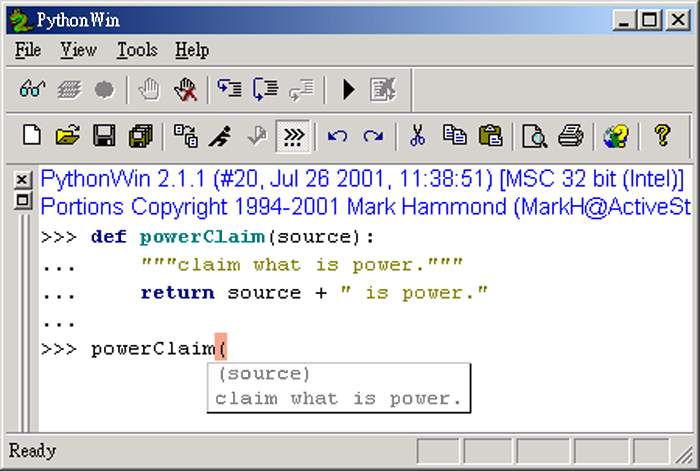

..
  練功坊

  巨蟒必殺術馬步功 (上)

  文．馬兒 <marr@slat.org>

完成第一個模組的學習內容後，學員已經見識過Python的基本物件型別及常見的迴圈技術。在學習教材的第二個模組內容中，學員將認識下列之學習目標：「可變與不可變物件的差別」、「辭典集的介紹」、「函式的基本使用」、「模組的操作」、「檔案系統的應用」。這些內容將成為掌握系統環境的踏腳石，必須按部就班、循序漸近地徹底掌握，以便在進階應用時，真正發揮出 Python 的實用性。

●中標●
可變與不可變物件

Python 語言的世界充滿彈性，許多物件型別採取動態決定的運作方式，雖然絕大多數的場合都能滿足我們的需要，而且使用者也樂得少費心神於過多細節，但終究有些應用場合需要的是靜態物件，以便程式人員掌握程式流程及執行效率。「可變物件」(mutable object)與「不可變物件」(immutable object)的功能之一，就是提供程式人員在「彈性」與「控制」之間有所取決的機會。

先前內容中，已經介紹過的串列 (list) 與值組 (tuple)，正是「可變物件」與「不可變物件」的兩項例子。下列的操作範例將引出兩者的差異之處：

  >>> stone = ['brian']
  >>> id(stone)
  269468880
  >>> stone.extend(['mike', 'keith'])
  >>> stone
  ['brian', 'mike', 'keith']
  >>> id(stone)
  269468880

stone 是個串列物件，原本只有一個元素項目 'brian'，透過 stone 的 extend() 物件方法，可以加入 ['mike','keith'] 的元素項目，而達到改變串列物件的效果。值得注意的是，在使用 extend() 物件方法的前後，我們利用 id() 內建函式，分別取得 stone 物件的識別編號，發現 stone 的元素項目雖然改變了，但物件識別編號並未改變，代表了「這是同一個 stone 物件」。

  >>> beatle = ('john', 'paul')
  >>> beatle[0] = 'pete'
  Traceback (most recent call last):
    File "<stdin>", line 1, in ?
  TypeError: object doesn't support item assignment
  >>> id(beatle)
  269286768
  >>> beatle = ('john', 'paul', 'george', 'ringo')
  >>> id(beatle)
  269192080

beatle 是個值組物件，原本只有兩個元素項目，如果想要利用「指定運算」改變其中的元素項目內容，系統會傳回 TypeError 的錯誤訊息，表示值組物件並不支援指定運算的功能。接著，利用一行新的敘述再次定義 beatle 物件的內容，僅管系統沒有傳回錯誤訊息，再從 id() 內建函式所傳回的識別編號來看，可以證實，「雖然使用同樣的變數名稱，但兩個 beatle 已經是不同的物件了」。

  >>> dir(stone)
  >>> dir(beatle)

如果利用 dir() 的結果，來比較 stone 與 beatle 兩者之屬性項目，會發現值組並沒有像串列具備物件方法。由於串列是可變物件，所以內建許多物件方法藉以更動元素內容，換句話說，從功能層面來看，值組型別是「不可變的」串列型別。

●中標●
物件的比較方式

依照 Python 語言的資料模型，每個物件都會有一個識別編號，一個型別，以及一個(元素)內容(註1)。因此，整體而言，物件之間，可分為下列三種比較方式：

1. 是否屬於同一型別?

判斷方式，是使用到內建函式 type()，這在先前的內容裡已提及。type() 函式必須輸入一個參數，其結果會傳回參數物件的型別(註2)。

  >>> a = [1,2,3]
  >>> b = (1,2,3)
  >>> type(a) == type(b)
  0

2. 是否具有同樣的元素內容?

判斷方式，是直接使用 == 運算符號。若兩個物件型別相同，而且元素內容 (如果物件型別會區分順序的話，則元素順序亦會進行比較) 也相同，則會傳回1，否則就傳回 0 (註3)。

  >>> a = [1,2,3]
  >>> b = (1,2,3)
  >>> c = [1,2,3]
  >>> d = [3,2,1]
  >>> a == b
  0
  >>> a == c
  1
  >>> a == d
  0

3. 是否是同一個物件?

判斷方式，就是利用內建函式 id()，來取得物件的識別編號。兩個物件間的比較，更方便的方式，是使用 is 運算符號，若兩個物件的識別編號相同，則會傳回 1，否則就傳回 0。

  >>> a = [1,2,3]
  >>> b = a
  >>> a is b
  1
  >>> id(a)
  134650916
  >>> id(b)
  134650916

●中標●
容器物件與參考

若一個物件裡面，包含有一個可以參考到其他物件的值，這種物件就被稱為「容器物件」(container)或「集合物件」(collection)。請觀察下列的範例操作：

  >>> beatles = ['john','paul','george','ringo']
  >>> woodstock = ('janis',beatles)
  >>> woodstock
  ('janis', ['john', 'paul', 'george', 'ringo'])
  >>> beatles.remove('john')
  >>> woodstock
  ('janis', ['paul', 'george', 'ringo'])

在上述的例子中，物件 woodstock 是一個值組，屬於「不可變物件」，但它此時包含了另一個物件，所以角色上，也是一個「容器物件」。當我們改變 beatles 的內容時，容器物件的內容看起來也跟著改變，不過，本質上，物件 woodstock 還是不可變，而裡頭的 beatles 則是一個「參考」(reference)，指向實際的物件所在，如圖1所示。

因此，從容器物件的角度來觀察，我們也有機會看到不可變物件的元素值，發生「改變」的可能。不過，這些細節內容，可有待日後再加強說明。

●中標●
再談物件的操作

下列的例子，還是跟物件的可變/不可變特性相關(註4)，請在 Python 的交談環境中，觀察這些操作的變化情況：

  >>> beatle = ['john','paul','george','ringo']
  >>> id(beatle)
  >>> beatle.sort()
  >>> id(beatle)
  >>> a = [1,2,3]
  >>> id(a)
  >>> a = [4,5,6]
  >>> id(a)
  >>> a[:] = [7,8,9]
  >>> id(a)

如果你已經足夠熟悉可變物件的特性，不必實際操作，應該都能猜出結果。而下列則是一些「參考」與「複製」的差異，也值得觀察和練習：

  >>> a = [3,4,5]
  >>> b = (a,)
  >>> c = 3 * b
  >>> c
  ([3, 4, 5], [3, 4, 5], [3, 4, 5])
  >>> a.remove(5)
  >>> c
  ([3, 4], [3, 4], [3, 4])

上述例子稱為「參考式複製」(reference copy)，對物件c而言，它是元素內容為三個b的值組，而b則包含參考a，因此串列a進行改變時，物件b與c也會跟著改變。如果我們想要得到實際的物件元素複製，操作可類似下列方式：

  >>> c = []
  >>> for i in range(3):
  ...     for item in b:
  ...         c.append(item[:])
  ...
  >>> c
  [[3, 4, 5], [3, 4, 5], [3, 4, 5]]
  >>> c = tuple(c)
  >>> c
  ([3, 4, 5], [3, 4, 5], [3, 4, 5])

上述的小技巧，可以讓你獲得一份實體的複製，而不會受到原物件的影響。

●中標●
值組的優點

值組物件比串列物件少了一些彈性，但操作時仍有下列的優點：

1. 值組比串列執行效率佳

由於值組的內容可視為一群固定的數值，運算上效率較好。

2. 協助處理字串格式化

例如在print "%s plays %s" % (beatles,instr)的範例裡，值組可協助我們更直覺地進行字串格式化工作。

3. 可成為辭典集的鍵值

由於辭典集物件的鍵值必須具備不可變的性質，因此值組便可成為鍵值的候選。相關內容可待後續詳細介紹。

●中標●
辭典集型別

「辭典集」是整合式的資料型別，它以「鍵/值」(key/value)組對的方式運作，語法上使用「{」「}」符號來建立，範例如下：

  >>> beatle = {}

最簡單的方式，便是建立一個空的辭典集。

  >>> beatle['lead'] = 'john'
  >>> beatle = {'bass':'paul','guitar':'george'}

辭典集的指定方式有兩種，前者是利用索引值來逐一指定元素的內容，後者則是將所有的鍵/值內容，一次指定完畢，鍵/值之間使用「:」符號區隔，而元素之間同樣使用「,」符號區隔。

值得注意的是，辭鍵必須具備不可變特性，例如可以使用「數值」、「字串」、「值組」等型別，而辭值就可以是任意物件了。如圖2所示。

.. image:: ../img/2002_0302.png
    :alt: 圖2 辭典集的鍵/值映射示意

成功建立的辭典集，可以使用辭鍵來取值，如下列範例：

  >>> beatle['lead']
  'john'

●中標●
其他的辭典集運算

辭典集的操作方式相當多樣而具彈性，下列是一些操作範例：

  >>> beatle.has_key('lead')
  1
  >>> beatle.has_key('manager')
  0

利用物件方法has_key()，可以檢查辭典集是否存在你想要查詢的辭鍵，如果存在的話，其傳回值為1，如果不存在的話，則傳回值為0。

  >>> beatle.get('lead','none')
  'john'
  >>> beatle.get('manager','none')
  'none'

利用物件方法get()，可以更具彈性地取得辭典集的內容，get()需要輸入兩個參數，第一個是想要查詢的辭鍵，第二個則是一個回應字串。由於例子裡的辭鍵'lead'存在，它會傳回'lead'所對應的辭值內容，而辭鍵'manager'並不存在，則會傳回事先設定好的回應字串。

  >>> beatle = {'lead':'john','bass':'paul','guitar':'george','drum':'ringo'}
  >>> beatle.keys()
  ['guitar', 'drum', 'bass', 'lead']
  >>> beatle.values()
  ['george', 'ringo', 'paul', 'john']
  >>> beatle.items()
  [('guitar', 'george'), ('drum', 'ringo'), ('bass', 'paul'), ('lead', 'john')]

辭典集的元素內容，可以利用物件方法keys()、values()、items()來取得，這三個物件方法都不必輸入參數，分別會傳回辭鍵、辭值、鍵/值等完整的串列資料。

●中標●
重要的辭典集特性

字串、串列、值組，正是「序列物件」(Sequence)的三個例子，而辭典集則是「映射物件」(Mapping)的一個例子。所謂映射物件，就是由一個物件集合來作為另一個物件集合的辭鍵索引。因此，和序列物件相比，在索引的建立及操作上，辭典集的彈性就顯得較高，不過，映射物件並不做排序。最後，映射物件是可變物件，裡頭的元素內容改變後，並不會影響映射物件的識別編號。

在Python語言裡，辭典集是唯一的一個內建映射物件，它的功能等同於資料結構裡的「雜湊表」(hash)或「關連陣列」(associative array)。以下則是其他的相關操作範例：

  >>> beatle = {'lead':'john','bass':'paul','guitar':'george','drum':'pete'}
  >>> hurricane = {'drum':'ringo','manager':'brian'}
  >>> beatle.update(hurricane)
  >>> beatle
  {'guitar': 'george', 'manager': 'brian', 'drum': 'ringo', 'bass': 'paul', 'lead': 'john'}

辭典集有一個特別的物件方法 update()，它必須接受另一個辭典集為參數，然後會將參數物件的元素內容，逐一指定/更新到原本的辭典集物件裡。在上述例子中，辭鍵 'drum' 在 beatle 及 hurricane 裡都存在，所以 beatle 的 'drum':'pete' 會被更新為 'drum':'ringo'，而 'manager':'brian' 則是新增到 beatle 的元素內容。

  >>> beatle
  {'guitar': 'george', 'manager': 'brian', 'drum': 'ringo', 'bass': 'paul', 'lead': 'john'}
  >>> items = beatle.items()
  >>> items.sort()
  >>> items
  [('bass', 'paul'), ('drum', 'ringo'), ('guitar', 'george'), ('lead', 'john'), ('manager', 'brian')]
  >>> for key, value in items:
  ...     print key, value
  ... 
  bass paul
  drum ringo
  guitar george
  lead john
  manager brian

由於辭典集具有「元素不排序」的特性，因此在必要時，我們得額外利用些小技巧，以便將辭典集的內容以所需的順序取出。最簡單的排序方式，如上述所示，可以先利用一個變數將辭典集的元素內容儲存下來，由於這樣的變數物件會是一個串列，所以可以直接利用串列物件的物件方法 sort() 完成排序 (註5)。

●中標●
辭典集的優點

和串列的功能相比，辭典集可以使用數值或字串作為索引，使得它的應用更容易與日常需要結合，例如下列是一個星期名稱的辭典集：

  weeknames = {
    "Sunday":0, "Sun":0, "Su":0,
    "Monday":1, "Mon":1, "Mo":1, "M":1,
    "Tuesday":2, "Tue":2, "Tu":2,
    "Wednesday":3, "Wed":3, "We":3, "W":3,
    "Thursday":4, "Thu":4, "Th":4,
    "Friday":5, "Fri":5, "Fr":5, "F":5,
    "Saturday":6, "Sat":6, "Sa":6
  }

這樣的辭典集索引參考，可以用來配合字串比對的場合，顯得十分簡單明瞭。辭典集的另一項功能應用，是作為程式裡的流程分配表(dispatch table)，下列的範例是個程式示意：

  if user_choice == 1:
      function1()
  elif user_choice == 2:
      function2()
  ...

一般的程式流程採用 if... elif... 判斷方式，也可改用下列的寫作方式：

  dict = {"1":function1, "2":function2, ...}

  user_choice = raw_input()

  dict[user_choice]()

●中標●
函式的觀念基礎

Python語言的函式，主要是由敘述式(Statements)或表示式(Expressions)所組成，相關的例子，在先前的內容中已有提及，在此將正式介紹。

簡單地舉例來說，「knowledge == 'power'」是一個「比較表示式」，而「knowledge = 'power'」是一個「指定敘述式」，而且，這是最單純的格式，另外還有「複合式」，例如「age > 18 and gender == 'male'」是「複合表示式」，而「if ... else ...」是「複合敘述式」。

函式的使用目的，就是要做到「將程式邏輯區段予以分解獨立」，以及「程式區段模組重覆利用」的效果。最簡單的Python函式定義範例如下：

  >>> def powerClaim(source):
  ...     """claim what is power."""
  ...     return source + " is power."
  ... 

函式必須以def為字首，接著是函式名稱，如果函式接受參數的話，必須在括號內指定，接著是一個「:」符號。值得注意的是，函式在定義時，同樣要遵守縮排規則，所以第二行之後，都必須進行適當的縮排動作。

函式的第二行內容，慣例上是一個「三引號」字串，用以註釋這個函式的用途功能，稱為「文件字串」(Document String)。由於是「三引號」字串，所以可以跨行書寫文件字串的內容。在ActivePython的視窗環境裡，文件字串會被應用在提示功能裡，如圖3所示。

呼叫一個函式的方式，最基本的型式如下列範例：

  >>> powerClaim('knowledge')
  'knowledge is power.'

這是輸入參數的情況，順利傳回函式的執行結果。

  >>> powerClaim()
  Traceback (most recent call last):
    File "<stdin>", line 1, in ?
  TypeError: powerClaim() takes exactly 1 argument (0 given)

這是沒有輸入參數的情況，由於函式powerClaim()定義要輸入一個參數項目(即source變數物件)，所以系統會回應錯誤訊息，用以提示呼叫函式時，應該要如何配合參數項目。

  >>> powerClaim(13)
  Traceback (most recent call last):
    File "<stdin>", line 1, in ?
    File "<stdin>", line 3, in powerClaim
  TypeError: unsupported operand types for +: 'int' and 'str'
  >>> powerClaim('too','many')
  Traceback (most recent call last):
    File "<stdin>", line 1, in ?
  TypeError: powerClaim() takes exactly 1 argument (2 given)

這裡是另外兩種參數錯誤的情況。前者輸入的參數是數值物件，由於powerClaim()函式會進行參數變數與' is power'字串的「合併運算」，兩者的型別並無法完成此項運算。後者則是因為輸入的參數個數過多，錯誤訊息裡提示參數個數剛好為一個。

●中標●
再談文件字串

函式定義的第一行中，最後一個字元是「:」符號，接下來的一行，便是「三引號」字串。在Python環境裡，這個文件字串被儲存於內建屬性__doc__裡，其操作方式如下列範例：

  >>> dir(powerClaim)
  ['__call__', '__class__', '__delattr__', '__dict__', '__doc__', '__get__', '__getattribute__', '__hash__', '__init__', '__name__', '__new__', '__reduce__', '__repr__', '__setattr__', '__str__', 'func_closure', 'func_code', 'func_defaults', 'func_dict', 'func_doc', 'func_globals', 'func_name']

上述的執行結果，就是函式powerClaim的名稱空間內容，特別注意到__doc__以及func_doc這兩個內建屬性，我們可以利用下列的呼叫方式，來取出函式的文件字串內容，亦可參考圖4所示：

  >>> powerClaim.__doc__
  'claim what is power.'
  >>> powerClaim.func_doc
  'claim what is power.'

●中標●
函式參數預設值

函式的參數不但可以指定個數，也可以指定預設值，如下列範例所示：

  >>> def powerClaim(source='money'):
  ...     """claim what is power."""
  ...     return source + " is power."

和之前的範例相比，可以發現不同之處，在於 source='money' 的敘述，這表示函式本身不但只有一個參數項目，而且其預設值是 'money' 字串。

  >>> powerClaim()
  'money is power.'
  >>> powerClaim('sex')
  'sex is power.'

具備參數預設值的函式，呼叫時如果不輸入參數內容，則會以預設值輸入，此例即是 'money' 字串。當然，我們還是可以輸入需要的參數內容，運作方式就跟之前沒有兩樣了。

  >>> powerClaim.func_defaults
  ('money',)

除了 func_doc 內建屬性可以傳回函式的文件字串外，func_defaults 內建屬性可以傳回函式的預設值內容。在本例中，傳回的一個值組物件，元素即是 'money' 這個預設值字串。

●中標●
命名規則

學習至此，已經可說是獲得基本的函式操作觀念，我們將稍作休息，額外介紹些 Python 語言的變數命名規則 (函式的命名方式亦遵守這項規則)，以便接續的進階內容更加順暢。

1. 大小寫有別

Python 語言的變數是必須區分字母符號的大小寫，因此，beatle 與 Beatle 是兩個不同的變數。

2. 合法的識別字元

變數命名時，第一個字元必須是「字母」符號或「_」符號，而不可以是「數字」符號，例如 myName、one4all 與 _underName 都是合法的變數名稱，而 3Name 就是非法的變數名稱。

3. 關鍵字

例如 if、for 這些字眼，是 Python 系統環境的關鍵字，自然不允許被視為變數(註6)。

4. 保留字元

在 Python 語言裡，使用「_」、「__」為首的變數，都是具有特殊意義，例如我們先前所見過的 __builtins__ 或 __doc__。

●中標●
函式的進階操作

下列範例中，將描述如何定義一個階乘函式，這是一個較為實用的示範：

  >>> def fact(n):
  ...     """return the factorial value of n."""
  ...     result = 1
  ...     while n > 1:
  ...         result = result * n
  ...         n = n -1
  ...     return result
  ...

請試著將此函式的預設值指定為 10!，相信這項練習很容易完成。

接下來的範例，將描述一個乘積函式，它同時必須處理兩個參數項目：

  >>> def product(x,y):
  ...     """return the product of x and y."""
  ...     return x * y
  ...
  >>> product(2,3)
  6
  >>> product(y=3,x=2)
  6

兩個參數項目的函式，本身並沒有太複雜，定義時加個「,」符號區隔參數變數即可。而呼叫方式也是大同小異，而且可以把變數名稱明確指出。

  >>> def product(x,y=1):
  ...     """return the product of x and y."""
  ...     return x * y
  ...
  >>> product(5)
  5
  >>> product(y=3,x=2)
  6

上述範例則是搭配預設值的變化方式，請試著練習將兩個變數都指定預設值為 1。

  >>> def product(x=1,y=1):
  ...     """return the product of x and y."""
  ...     return x * y
  ...
  >>> product([1,2],2)
  [1, 2, 1, 2]

這是一個特例狀況，由於「*」所代表的相乘運算，並不僅限於數值物件，所以輸入串列時，同樣可以進行適當的運算，這樣的彈性，被稱為「多載」(Overloading)。相關介紹，有機會將在日後繼續提出。

最後，和多數程式語言不同之處，在於 Python 只有「函式」(Function)，而無「副程式」(Subroutine)。如果 Python 的函式沒有傳回值的話，預設會傳回「NONE」這個特殊物件。整體而言，Python 屬於動態型別 (Dynamically Typed Language) 的程式語言，因為它不需要事先進行資料型態的宣告，另一方面，它也是強式型別 (Strongly Typed Language) 的程式語言，因為它的資料型別一旦確定，便會影響相關的物件操作模式(註7)。

●中標●
小結

在這部份的教學內容裡，學員應該已經具備下列觀念及技巧：

* 串列物件與值組物件的相關操作方式。
* 可變物件與不可變物件的差異之處。
* 物件進行識別時的分辨方式。
* 認識 Python 的辭典集物件。
* 熟悉辭典集物件的操作方式。
* 認識序列物件與映射物件的異同之處。
* 認識表示式與敘述式。
* 熟悉函式之基本設定與操作方式。
* 熟悉文件字串的功能。
* 了解 Python 的變數命名規則。
* 了解函式的操作技巧，包括參數預設值及多參數的設定方式。

下次內容中，將介紹到檔案系統的操作技巧。

●中標●
相關資源

註1 詳細的物件模型說明，可參考 http://www.python.org/doc/current/ref/objects.html 網頁。

註2 type() 的傳回值是一個稱為 type 的物件，應用方式在 Python Library Reference 裡附有範例介紹，可參考 http://www.python.org/doc/current/lib/built-in-funcs.html 網頁。

註3 例如，「辭典集」物件型別並不區別元素順序，只要兩個辭典集的元素項目相同，它們的元素內容就被視為相同。

註4 詳細的「可變物件操作」說明，可參考 http://www.python.org/doc/current/lib/typesseq-mutable.html 網頁。

註5 相關的「辭典集排序」處理方式，可參考 http://aspn.activestate.com/ASPN/Cookbook/Python/Recipe/52306 網頁。

註6 其他詳細的「識別字元」說明，可參考 Python Reference Manual說明，線上版本於 http://www.python.org/doc/current/ref/identifiers.html 網頁。

註7 相關的「程式語言型態」討論，可參考 http://diveintopython.org/odbchelper_funcdef.html 網頁。

..
  作者簡介

  馬兒是一位Linux愛好者，對於Python與Zope也很喜歡。平常聽英國的老搖滾，喜歡的團體有Beatles、Led Zeppelin、Smiths、Kula Shaker、Love Psychedelico。其他的興趣，包括心理學、芥川龍之介的小說。你可以從Google輸入Penelope Marr，找到他的相關資料。

