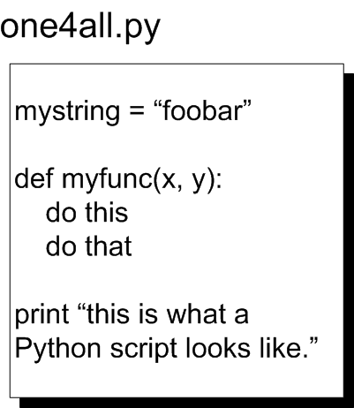
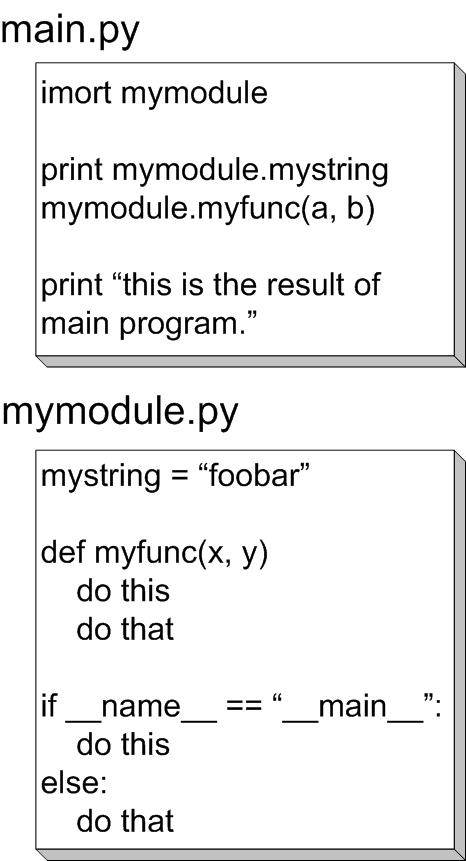
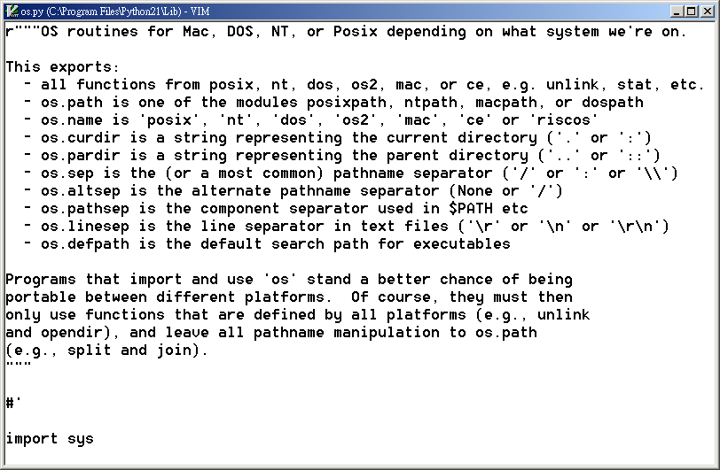
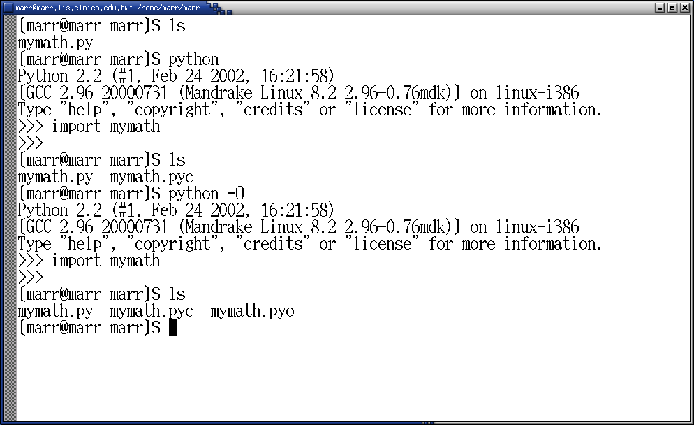
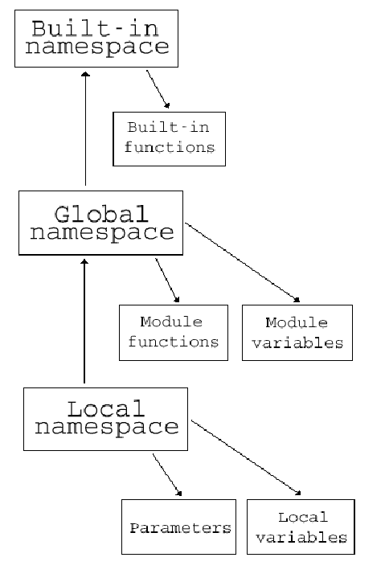

..
  練功坊

  巨蟒必殺術馬步功 (下)

  文．馬兒 <marr@slat.org>

了解作業系統環境的操作，正是學習程式語言的另一項紮馬步工夫。作業系統必須提供基本的「檔案系統」(filesystem)與「行程管理」(process management)服務，程式人員通常也都會善用這些服務，以簡化資料存取與運算溝通的主要工作。在本單元階段裡，學員將透過操作練習，了解「模組的基本操作」、「檔案系統的應用」、「名稱空間的運作方式」。

從函式到模組
------------

先前的內容中，已經介紹過函式 (function) 的定義與呼叫方式，而即將要介紹的模組，便是函式功能的延伸。模組 (module) 本身是檔案，內含敘述式與函式，本質上跟一個命令稿 (script) 是一樣的，而其延伸檔名同樣必須是.py。由於程式功能被適當切割，各個功能模組便可獨立開發維護，必要時再整合包裝，而Python的結構與設計，也有助於程式人員快速進行功能切割與整合(圖1、圖2)。

下列的程式內容，即是先前介紹函式時的範例，請利用文書編輯器 (例如vim) 輸入內容，並將檔案名稱指定為 mymath.py 加以存檔：

  def fact(n):
      """return the factorial value of n."""
      result = 1
      while n > 1:
          result = result * n
          n = n -1
      return result

完成模組檔案的建立後，叫用方法是透過 import 敘述式，操作如下所示：

  $ python
  >>> import mymath
  >>> mymath.fact(5)

「import mymath」裡的mymath，指的就是上述的模組檔案(省略延伸檔名.py)，順利「載入」模組檔案後，模組裡頭所設定的變數或函式，均會生效。如此一來，便可利用類似 mymath.fact(5) 這樣的指令，來呼叫執行模組裡的函式。如果模組內容需要新增修改時，只要重新以文書編輯器打開模組檔案即可進行。下列則是修改後的 mymath.py 模組檔案，內含 fact()、prod()、fibo() 等函式，以及一個 mypi 變數：

  def fact(n):
      """return the factorial value of n."""
      result = 1
      while n > 1:
          result = result * n
          n = n -1
      return result
  
  def prod(x, y):
      """return the product of x and y"""
      return x * y
  
  def fibo(n):
      """return a Fibonacci series up to n"""
      a, b = 0, 1
      while b < n:
          print b,
          a, b = b, a+b
  
  mypi = 3.1415926

換句話說，我們利用 mymath.py 來收集一群和數學相關的函式，載入完成後，就可以取用裡頭的所有函式，範例如下：

  >>> import mymath
  >>> mymath.fact(5)
  120
  >>> mymath.prod(3,7)
  21
  >>> mymath.fibo(100)
  1 1 2 3 5 8 13 21 34 55 89

系統標準模組
------------

上述的操作方式，使用者必須自行編寫模組內容，稱為「使用者定義模組」(User Defined Modules)，另一種方式，則稱為「系統標準模組」(System Standard Modules)。請試試下列的指令：

  $ ls /usr/lib/python2.2
  $ ls /usr/lib/python2.2/*.py
  $ ls /usr/lib/python2.2/os.*

以 Mandrake Linux 為例，Python 程式的函式庫檔案，預設安裝在 /usr/lib 目錄裡，例如 python2.2 指的就是 2.2 版本的 Python 程式檔案，版本編號需視實際環境而定，而目錄裡包含類似 string.py、os.py、find.py 的檔案。在這些檔案裡，不同的延伸檔名，分別代表不同的意義(表1)。

+----------+----------------------+
| 延伸檔名 | 意義                 |
+==========+======================+
| *.py     | 模組原始碼           |
+----------+----------------------+
| *.pyc    | 編譯過的模組bytecode |
+----------+----------------------+
| *.pyo    | 最佳化的模組bytecode |
+----------+----------------------+

以 Windows 2000 為例，Python 程式的函式庫檔案，則可能安裝在 C:\Program Files\Python22\Lib 目錄裡，使用者也可以直接閱讀這些.py檔案的程式碼(圖3)，相信部份檔案的內容，對學員而言，已不再全是天書。

系統操作模組的基本運作方式，以 /usr/lib/python2.2/os.py 這個模組檔案為例，使用時，就是直接「import os」即可。系統何以知道使用者想要載入 /usr/lib/python2.2/os.py 模組呢? 這在稍後的「模組搜尋路徑」裡將詳細說明。

由此可知，「使用者定義模組」是使用者自行撰寫編輯的程式內容，而「系統標準模組」則是完成Python環境安裝時，Python函式庫所預設提供的程式內容。善用系統提供的預設模組，能夠帶來不少便利與效率，因此，了解系統模組的運作細節，就顯得相當重要。

模組搜尋路徑
------------

Python實際搜尋模組時，會按照特定目錄路徑順序逐一搜尋，此一路徑設定值，可以由sys模組裡的path變數取得，如下列範例所示：

  >>> import sys
  >>> sys.path
  ['', '/usr/lib/python2.2', '/usr/lib/python2.2/plat-linux-i386', '/usr/lib/python2.2/lib-tk', '/usr/lib/python2.2/lib-dynload', '/usr/lib/python2.2/site-packages', '/usr/lib/python2.2/site-packages/Numeric', '/usr/lib/python2.2/site-packages/PIL']
  >>> import marr
  Traceback (most recent call last):
    File "<stdin>", line 1, in ?
  ImportError: No module named marr

也就是說，import 所呼叫的模組名稱，依搜尋路徑順序，優先比對到模組檔名的路徑便會馬上回傳使用。如果找不到 import 的模組名稱，則會傳回 ImportError 的錯誤訊息。以載入 foo 模組為例，其實際尋找模組的過程順序如下：

1. 是否存在名為 foo 的目錄，並且裡頭含有該模組的檔案。
2. 是否存在 foo.so、foomodule.so、foomodule.sl 或是 foomodule.dll
3. 是否存在 foo.pyo
4. 是否存在 foo.pyc
5. 是否存在 foo.py

以一個 .py 的 Python 原始碼檔案而言，經過編譯後，會產生一個延伸檔名為 .pyc 的 bytecode 執行檔，當尋找某個模組名稱時，要是 .py 檔案的日期不比 .pyc 檔案來得新，Python 直譯器會直接將編譯好的 .pyc 檔案載入，若是 .py 檔案的日期比 .pyc 檔案來得新，通常就表示 .py 檔案內容已更新，Python 直譯器會重新編譯之，以產生新的 .pyc 檔案，然後才進入載入動作。而 .pyo 檔案只有在直譯器以 -O 選項啟動之後才會產生，這類檔案裡的資訊通常比 .pyc 檔案來得多，包含有原始程式的行號以及除錯資訊，因此 .pyo 檔案的載入速度會較慢，但程式的執行速度會較快。

實際上，.pyc 或是 .pyo 檔案的編譯動作，是在系統或程式裡頭呼叫 import 敘述後才會發生(圖4)，對 Python 語言來說，模組檔案不止是設計概念的切割，當然也要從強化模組執行效率的角度，鼓勵程式員善用模組檔案功能。

如果自製的模組檔案越來越多，其應用自然越顯重要，此時便要認真為自製模組找個適當的存放路徑，比較常見的方式之一，是設定相關的環境變數值，例如 PYTHONPATH 變數(表2)。

表2: Python 相關環境變數設定

  變數名稱	說明

  PYTHONDEBUG	與 python -d 啟動模式相同。可產生 Python 的語法解析除錯資訊。

  PYTHONHOME	與模組搜尋路徑設定相關的變數。

  PYTHONINSPECT	與 python -i 啟動模式相同。以交談模式來執行 Python 程式。

  PYTHONOPTIMIZE	與 python -O 啟動模式相同。以最佳化模執行 Python 程式。

  PYTHONPATH	增加模組搜尋路徑。

  PYTHONSTARTUP	交談模式就緒前所執行的程式路徑。

  PYTHONUNBUFFERED	與 python -u 啟動模式相同。記錄未做緩衝的二元標準輸出輸入。

  PYTHONVERBOSE	與 python -v 啟動模式相同。執行過程詳列相關處理資訊。

編譯時期加入的模組
------------------

進一步地探討，系統標準模組其實分成兩種：一種是存放在檔案系統裡的模組檔案，例如/usr/lib/python2.2目錄裡的檔案，而os.py即是此例，另一種是在Python系統進行編譯時，被編譯進入主程式的模組，而 sys 模組即是此例。

想知道 Python 系統裡包含了哪些編譯時期加入的模組，請執行下列指令：

  >>> import sys
  >>> sys.builtin_module_names
  ('__builtin__', '__main__', '_sre', '_symtable', 'exceptions', 'gc', 'imp', 'linuxaudiodev', 'marshal', 'new', 'posix', 'signal', 'sys', 'thread', 'xxsubtype')

這些編譯時期加入的模組，隨著Python啟動後，即可隨時透過import來取用，模組本身不必存在於檔案系統中。下列將分別介紹sys與os兩個模組，它們經常被用來協助處理日常工作。

sys 模組
--------

本模組能夠提供直譯器運作時的重要資訊，例如命令列參數、搜尋路徑、系統標準輸入、系統標準輸出等。整體而言，可分成三類資訊及功能(表3)，而完整的sys模組資訊，可參考線上文件內容(註1)。

sys 模組主要之資訊及功能

動態物件
	argv	命令列的參數值，其中的argv[0]代表的是命令稿本身。
	path	模組的搜尋路徑，其中的path[0]代表的是命令稿本身的執行目錄，或是''。
	modules	已載入模組的辭典集。
	stdin	標準輸入之檔案物件，由raw_input()與input()來使用。
	stdout	標準輸出之檔案物件，由print敘述式來使用。
	stderr	標準錯誤物件，由錯誤訊息所使用。

靜態物件
	maxint	能支援的最大整數(最小整數即-maxint-1)。
	maxunicode	能支援的最大字元。
	builtin_module_names	編譯進直譯器之內建模組的值組。
	version	以字串來表示的直譯器版本號碼。
	version_info	以值組來表示的直譯器版本資訊。
	copyright	直譯器的授權條款資訊。
	platform	作業平台的識別資訊。
	executable	直譯器的所在路徑。
	prefix	函式庫搜尋路徑前置目錄。
	exec_prefix	主機相依的函式庫搜尋路徑前置目錄。

函式
	exit()	透過SystemExit例外來離開直譯器。

舉例來說，sys.ps1 與 sys.ps2 分別代表 Python 直譯器之互動環境提示符號，如下列所示：

  >>> import sys
  >>> sys.ps1
  '>>> '
  >>> sys.ps2
  '... '

下列的命令稿範例，則示範了如何利用 sys.argv 來和命令列參數互動：

  #! /usr/bin/python
  
  import sys
  print sys.argv
  if '-h' in sys.argv or '--help' in sys.argv:
      print '''
  help.py -- does nothing useful (yet)
  options: -h, or --help -- display this help
  '''
  else:
      print '''I don't recognize the options.'''

可以將上述的命令稿命名為 help.py，執行結果類似下列，由此可知 sys.argv 是一個串列資料，其字串項目就是命令列的字串值：

  $ ./help.py -h
  ['./help.py', '-h']
  
  help.py -- does nothing useful (yet)
  options: -h, or --help -- display this help
  
  $ ./help.py foobar
  ['./help.py', 'foobar']
  I don't recognize this option

照上述程式格式，我們可以繼續以一堆迴圈判斷來增加選項內容，但顯然不是理想的方式。比較好的方式，是利用getopt模組以及try... expect...的語法功能，日後會另行解說。

os模組
------

os模組提供跟作業系統相關的服務，包括檔案系統(filesystem)與行程管理(process management)等，因此，類似查看現行目錄的檔案列表、現有行程環境，都需要事先呼叫載入os模組。除此之外，os模組裡面包含許多的可攜式介面，這些介面可以存取到Unix或Macintosh作業環境的系統服務，亦即是由posix, nt, dos, os2, mac, ce等模組其中之一，載入沿用。下列則是一些常見的變數服務，操作環境是在cygwin上：

  >>> import os
  >>> os.name
  'posix'
  >>> os.uname()
  ('CYGWIN_NT-5.0', 'MOBILE', '1.3.10(0.51/3/2)', '2002-02-25 11:14', 'i686')

os.name會傳回一個字串變數，指示目前作業環境的名稱，例如'posix'、'nt'、'os2'、'mac'、'dos'等。以Linux作業環境為例，就會傳回'posix'字串值。

os.uname()會傳回一個值組物件，內含一些與系統環境有關的字串資訊，包括「系統名稱」、「主機名稱」、「版本名稱」、「平台名稱」等。

另外，os.environ會以辭典集資料型式，傳回環境變數的設定值，因此使用者可以利用「辭鍵」方式查詢特別環境變數內容，如下例：

  >>> import os
  >>> os.environ["PATH"]
  '/usr/local/bin:/bin:/usr/bin:/usr/X11R6/bin:/usr/games:/sbin:/usr/sbin'

下列範例是說明如何列出現行目錄裡的檔案資訊列表，兩種方式均可，但第二種方式的可移植性較高：

  >>> os.listdir('.')
  >>> os.listdir(os.curdir)

os 模組主要之資訊及功能

增加可移植性

	os模組的內容，是由posix、nt、dos、os2、mac、ce等模組其中之一載入沿用。
	os.path是沿用自posixpath、ntpath、macpath、dospath模組之一。
	os.curdir是'.'或':'字串，用以代表系統環境所使用的現行目錄。
	os.pardir是'..'或'::'字串，用以代表系統環境所使用的上層目錄。
	os.sep是'/'或':'或'\\'字串，用以代表系統環境所使用的路徑名稱分隔符號。
	os.linesep是'\r'或'\n'或'\r\n'字串，用以代表檔案資料分行的符號。
	實作上，為了在不同作業環境下都能一致地操作os模組功能，必須將路徑名稱的處理，獨立交由os.path搭配split與join來進行。

檔案系統服務

	chdir(path)能將現行目錄變更至特定的目錄。
	chmod(path, mode)能變更特定檔案的存取權限。
	rename(old, new)能變更特定檔案或目錄的名稱。
	rmdir(path)能將特定目錄加以移除。
	mkdir(path)能建立一個新的目錄。
	listdir(path)會以串列資料型式傳回特定目錄所包含的檔案名稱。
	getcwd()會傳回現行目錄的字串資料。
	link(src, dst)能為特定檔案建立硬式連結。
	unlink(path)功能與remove(path)相同，將特定檔案的連結取消。
	symlink(src, dst)能為特定檔案建立軟式連結。

行程管理

	fork()會產生一個子行程，並傳回一個pid號碼資訊。
	getpid()會傳回現有行程的id號碼資訊。
	getuid()會傳回現有行程的使用者id資訊。

模組的操作方式
--------------

事實上，載入模組還有另外一種方式，以「from ... import ...」型式進行(註2)，如下列範例：

  >>> from mymath import fact, fibo

或是

  >>> from mymath import *
  >>> fact(5)
  >>> fibo(100)

也就是，利用類似「from mymath import fact, fibo」可以個別載入使用者需要的模組變數或函式，而「from mymath import *」則是一次載入模組裡的所有變數與函式(除了 _ 為首的變數)，和原本直接「import ...」型式相比，其基本的差異處有二：

1. 可以直接使用模組裡的變數或函式，而無須類似mymath.myfunc()的格式。
2. 「from ... import ...」並不會把 _ 為首的變數載入生效。

有項非常重要的模組操作技巧，來自於模組__name__屬性變數的應用。每個正在執行的主要程式，其程式名稱 (即 __name__ 屬性) 會是__main__，如果是以模組型態被import進來，那麼該模組程式便會以原本檔案名稱為__name__的值。請觀察下列程式範例的說明，兩個極其簡化的「土製模組」。

  example$ cat other_mod.py
  #!/usr/bin/python
  
  print "this is from other_mod."
  print __name__
  
  example$ chmod 755 other_mod.py; ./other_mod.py
  this is from other_mod.
  __main__
  
  example$ cat my_mod.py
  #!/usr/bin/python
  
  """Simple module example for illustrating how __*__ works."""
  import other_mod
  
  print "this is from my_mod."
  print __name__
  
  example$ chmod 755 my_mod.py; ./my_mod.py
  this is from other_mod.
  other_mod
  this is from my_mod.
  __main__

被 import 的模組檔案，其內容會被執行，所以範例 my_mod.py 在執行之後，會先讀進 other_mod.py 的程式片段，接著才是 my_mod.py 的程式本體片段。利用上述的運作方式，最常見的技巧就是「if __name__ == "__main__"」，參考下列名為 run_mod.py 的例子：

  #!/usr/bin/python
  
  import sys
  
  def usage():
      """show usage message."""
      print "run_mod.py: a module demo"
      print "option: -v : show version info"
  
  def test(angel="becky"):
      print angel + " is my angel."
  
  if sys.argv[1] == '-v':
      print "Version 0.1"
  else:
      usage()
  
  if __name__ == "__main__":
      test()
      print ""

上述的模組檔案若是獨立執行，則__name__屬性變數值會是"__main__"，因此最後的表示式為真，會執行test()函式。若是run_mod.py由其他程式所import，則最後的程式片斷便不會被執行。

import模組的敘述式通常會在一個命令稿的前段指定，但這僅是慣例，並非表示必須如此。

名稱空間 (namespace) 及其有效領域 (scope)
-----------------------------------------

回過頭來，我們再次透過 dir() 來觀察模組檔案載入後的物件變化情況。

請將現行目錄設定在 my_mod.py 檔案存放的目錄，然後進入 Python 的直譯器交談環境。

  example$ python
  Python 2.2 (#1, Feb 24 2002, 16:21:58)
  [GCC 2.96 20000731 (Mandrake Linux 8.2 2.96-0.76mdk)] on linux-i386
  Type "help", "copyright", "credits" or "license" for more information.
  >>> dir()
  ['__builtins__', '__doc__', '__name__']
  >>> import my_mod
  this is from other_mod.
  other_mod
  this is from my_mod file.
  my_mod
  >>> dir()
  ['__builtins__', '__doc__', '__name__', 'my_mod']
  >>> dir(my_mod)
  ['__builtins__', '__doc__', '__file__', '__name__']
  >>> print my_mod.__doc__
  Simple module example for illustrating how __*__ works.
  >>> print my_mod.__file__
  my_mod.py
  >>> 

整個運作過程，依序可以分解如下：

1. 每次 Python 啟動時，它會產生一個名為 __main__ 的模組物件，此物件本身當然有其相關資訊，所以我們可以透過 dir() 來取得。
2. 每次呼叫 import 內建函式之後，Python 會載入另一個模組物件，並將其物件相關資訊併進 __main__。
3. 由於兩個模組物件的變數名稱，有若干重複之處，如上述例子裡的 __builtins__、__doc__、__name__，在取用變數資訊時，必須有辦法加以區別才行。
4. Python 區別變數資訊的方法，如上例所示，是類似 __doc__ 與 my_mod.__doc__ 這樣的不同表示法。
5. 每個模組物件，都會伴隨一份物件資訊，以辭典集型別儲存在系統當中，而這樣的物件資訊內容，包括其變數、函式、物件等，都成為辭典集裡所記錄的鍵值或屬性值。
6. 上述的辭典集物件資訊，我們把它簡稱為「名稱空間」(namespace)。
7. 內建函式 dir() 的功能，可以把名稱空間的名稱資訊全部列出。

除了基本的資料型別之外，Python 裡的每一個模組物件都擁有自己的名稱空間，並可能在程式執行過程中，管轄部份的變數項目，或是與其他程式共用部份變數(註3)。下列是一個範例程式，可以協助列出模組物件的名稱資訊。

  example$ cat namespace.py
  #!/usr/bin/python
  import sys
  k = sys.modules.keys()
  print "Keys:", k
  print "-" * 30
  for i in k:
      if i == "__main__":
          print ">>>", i, "__dict__", sys.modules[i].__dict__
  print "-" * 30
  print dir()

在實務設計上，Python 程式人員會運用模組的方式，將物件做適當的切割，切割好的程式可以被包含在一個Python類別庫 (package) 裡，以便進一步有效管理大型的軟體專案。有了函式、模組、類別庫等一系列的架構，我們便可更直覺地管理軟體專案的物件體系(註4)。

小結
----

在這部份的教學內容裡，學員應該已經具備下列觀念及技巧：

* 模組之基本運作概念。
* 使用者如何自訂模組檔案。
* 系統標準模組檔案。
* sys 與 os 模組之常見功能。
* 利用 sys.path 與 PYTHONPATH 環境變數來管理模組搜尋路徑。
* 模組載入的兩種方式。
* __name__ 屬性變數之運作原理及使用技巧。
* 熟悉名稱空間之運作原理。

相關資源

註1 詳細的 sys 模組說明，可參考 http://web.pydoc.org/2.2/sys.html 網頁。 
註2 詳細的模組應用說明，可參考 http://diveintopython.org/odbchelper_testing.html 網頁。

註3 進階的 scope 議題討論，可參考 http://www.onlamp.com/pub/a/python/2001/04/19/pythonnews.html 網頁。

註4 Zope 系統是一套 Web Application Server 程式，其架構設計正是 Python 類別庫的大型組合，相關介紹可參考 http://www.zope.org/ 網站。

